# 📬 MÓDULO 2: Comunicación y Contratación - COMPLETADO

**Fecha de Implementación**: 24 de Octubre de 2025  
**Status**: ✅ Core Funcional - 🚧 Ofertas Pendientes de Backend

---

## 🎯 Objetivo del Módulo

Facilitar la comunicación en tiempo real entre clientes y profesionales, permitiendo:
- Chat instantáneo con Firebase Firestore
- Sistema de ofertas formales
- Negociación y contratación de servicios
- Notificaciones en tiempo real

---

## 📊 Resumen Ejecutivo

### ✅ Funcionalidades Implementadas

| Componente | Status | Tecnología | Descripción |
|------------|--------|------------|-------------|
| **Chat en Tiempo Real** | ✅ COMPLETO | Firestore | Mensajería instantánea con Firebase |
| **Lista de Conversaciones** | ✅ COMPLETO | React + Firestore | Listado dinámico con búsqueda |
| **Notificaciones** | ✅ COMPLETO | Firestore Subscriptions | Badge con contador en navbar |
| **Mensajes con Imágenes** | ✅ COMPLETO | Base64 + Firestore | Adjuntar y visualizar fotos |
| **Sistema de Ofertas** | 🚧 PARCIAL | UI Completa | Falta integración backend |
| **Pagos con MercadoPago** | ⏳ PENDIENTE | - | Endpoint backend requerido |

---

## 🏗️ Arquitectura Implementada

### Estructura de Firebase Firestore

```
firestore/
├── chats/
│   └── {chatId}/
│       ├── participants: string[]
│       ├── participantsData: {
│       │   userId: { name, photo, role }
│       │ }
│       ├── trabajoId?: string
│       ├── ofertaId?: string
│       ├── lastMessage: { text, senderId, timestamp }
│       ├── createdAt: Timestamp
│       └── updatedAt: Timestamp
│
├── messages/
│   └── {chatId}/
│       └── messages/
│           └── {messageId}/
│               ├── senderId: string
│               ├── senderName?: string
│               ├── senderPhoto?: string
│               ├── text: string
│               ├── timestamp: Timestamp
│               ├── read: boolean
│               ├── type: 'text' | 'image' | 'file'
│               ├── imageUrl?: string (Base64)
│               └── fileUrl?: string
│
└── user_chats/
    └── {userId}/
        └── chats/
            └── {chatId}/
                ├── lastMessage: string
                ├── lastMessageTime: Timestamp
                ├── unreadCount: number
                ├── otherUserId: string
                ├── otherUserName: string
                ├── otherUserPhoto?: string
                └── trabajoId?: string
```

### Flujo de Datos

```mermaid
graph LR
    A[Usuario Click Contact] --> B[chatService.getOrCreateChat]
    B --> C{Chat Existe?}
    C -->|No| D[Crear Chat + user_chats]
    C -->|Sí| E[Obtener chatId]
    D --> E
    E --> F[Redirect /chat/chatId]
    F --> G[useChat Hook]
    G --> H[subscribeToMessages]
    H --> I[Renderizar ChatWindow]
    I --> J[Usuario Envía Mensaje]
    J --> K[chatService.sendMessage]
    K --> L[Actualizar Firestore]
    L --> M[Notificación Tiempo Real]
    M --> N[Actualizar UI + Badge]
```



---

## 📁 Archivos Creados/Modificados

### ✅ Archivos Completados

#### **Frontend - Servicios**

1. **`frontend/lib/firebase/chat.service.ts`** (✅ COMPLETO)
   - Clase `ChatService` con métodos:
     - `getOrCreateChat()` - Crear/obtener conversación
     - `sendMessage()` - Enviar mensaje de texto
     - `sendImageMessage()` - Enviar imagen (Base64)
     - `subscribeToMessages()` - Escuchar mensajes en tiempo real
     - `subscribeToUserChats()` - Escuchar lista de chats
     - `markMessagesAsRead()` - Marcar como leído
     - `getTotalUnreadCount()` - Contador total
     - `getChatInfo()` - Obtener metadata del chat

2. **`frontend/lib/firebase/config.ts`** (✅ COMPLETO)
   - Configuración de Firebase
   - Exporta: `db`, `storage`, `getAnalyticsInstance()`, `getMessagingInstance()`

#### **Frontend - Hooks**

3. **`frontend/hooks/useChat.ts`** (✅ COMPLETO)
   - Hook para gestionar chat individual
   - Retorna: `messages`, `isLoading`, `sendMessage()`, `sendImageMessage()`, `markAsRead()`

4. **`frontend/hooks/useChatList.ts`** (✅ COMPLETO)
   - Hook para lista de conversaciones
   - Retorna: `chats[]`, `isLoading`, `totalUnread`
   - Conversión automática de Firestore a interfaz compatibilidad

#### **Frontend - Componentes UI**

5. **`frontend/components/chat/ChatList.tsx`** (✅ COMPLETO)
   - Lista de conversaciones con búsqueda
   - Badge de mensajes no leídos
   - Indicador de usuario online
   - Formato de tiempo inteligente (Hoy, Ayer, dd/MM)
   - Avatar con iniciales fallback
   - Botón "Nueva Conversación"

6. **`frontend/components/chat/ChatWindow.tsx`** (✅ COMPLETO)
   - Ventana de chat individual
   - Scroll automático a último mensaje
   - Input de mensaje con auto-resize
   - Adjuntar imágenes (preview + validación)
   - Indicador de "leído" (checkmarks)
   - Header con avatar y status online
   - Formato de mensajes con burbujas (propios/ajenos)

7. **`frontend/components/chat/ChatMessage.tsx`** (✅ COMPLETO - existente)
   - Renderizado individual de mensajes
   - Soporte para texto + imágenes
   - Indicador de lectura (Check/CheckCheck)

8. **`frontend/components/chat/ChatInput.tsx`** (✅ COMPLETO - existente)
   - Input con auto-resize
   - Enter to send, Shift+Enter for newline
   - 2000 caracteres máximo

#### **Frontend - Páginas**

9. **`frontend/app/chat/page.tsx`** (✅ COMPLETO - existente)
   - Layout master de chat
   - Grid responsivo (mobile/desktop)
   - Integración ChatList + ChatWindow
   - Estado vacío animado

10. **`frontend/app/chat/[chatId]/page.tsx`** (✅ REFACTORIZADO)
    - Reemplazados mocks con ChatWindow real
    - Panel lateral de ofertas
    - Formulario crear oferta (solo profesionales)
    - Botones aceptar/rechazar (solo clientes)
    - Layout 2+1 columnas (desktop)

#### **Frontend - Layout**

11. **`frontend/components/layout/Navbar.tsx`** (✅ ACTUALIZADO)
    - Badge con contador de mensajes no leídos
    - Suscripción en tiempo real a `user_chats`
    - Botón "Mensajes" en desktop + mobile
    - Indicador con `unreadCount > 99 ? '99+' : unreadCount`

---

## 🔧 Integración con Backend (Pendiente)

### Endpoints Requeridos

#### **1. Crear Oferta**

```typescript
POST /api/v1/professional/ofertas
Body: {
  chat_id: string;
  descripcion: string;
  precio: number;
}
Response: {
  oferta_id: string;
  estado: "OFERTADO";
  fecha_creacion: string;
}
```

#### **2. Aceptar Oferta**

```typescript
POST /api/v1/cliente/ofertas/{oferta_id}/accept
Response: {
  payment_url: string; // Link de MercadoPago
  pago_id: string;
}
```

#### **3. Rechazar Oferta**

```typescript
POST /api/v1/cliente/ofertas/{oferta_id}/reject
Response: {
  success: boolean;
}
```

#### **4. Listar Ofertas por Chat**

```typescript
GET /api/v1/ofertas/chat/{chat_id}
Response: {
  ofertas: Oferta[];
}
```

---

## 💡 Funcionalidades Implementadas - Detalle

### 1️⃣ Chat en Tiempo Real

**Características:**
- ✅ Mensajes instantáneos (Firestore real-time)
- ✅ Adjuntar imágenes (Base64, max 5MB)
- ✅ Scroll automático a último mensaje
- ✅ Indicador de "leído" con checkmarks (✓ / ✓✓)
- ✅ Formato de burbujas (azul/gris según emisor)
- ✅ Timestamp inteligente (HH:mm, Ayer, dd/MM)
- ✅ Avatar con iniciales fallback
- ✅ Indicador de usuario online (punto verde)

**Flujo de Uso:**
1. Cliente ve perfil de profesional
2. Click en botón "Contactar"
3. Se crea conversación en Firebase
4. Redirect a `/chat/{chatId}?name=Juan&photo=url`
5. ChatWindow se suscribe a mensajes
6. Ambos usuarios ven mensajes en tiempo real

### 2️⃣ Lista de Conversaciones

**Características:**
- ✅ Vista de todas las conversaciones del usuario
- ✅ Búsqueda por nombre
- ✅ Badge con mensajes no leídos por chat
- ✅ Ordenado por último mensaje (más reciente primero)
- ✅ Preview del último mensaje
- ✅ Indicador de "online" en avatar
- ✅ Botón "Nueva Conversación" (diálogo)

**Estados:**
- Estado vacío: "No tienes chats" + botón crear
- Cargando: Skeleton de 5 items
- Con datos: Lista con scroll infinito

### 3️⃣ Notificaciones en Navbar

**Características:**
- ✅ Badge rojo con contador total
- ✅ Actualización en tiempo real (Firestore subscription)
- ✅ Formato `99+` si excede 99
- ✅ Visible solo si usuario autenticado
- ✅ Click lleva a `/chat`

**Implementación:**
```typescript
useEffect(() => {
  if (!user) return;
  
  const unsubscribe = chatService.subscribeToConversations(user.id, (conversations) => {
    const total = conversations.reduce((sum, conv) => sum + (conv.unreadCount || 0), 0);
    setUnreadCount(total);
  });
  
  return () => unsubscribe();
}, [user]);
```

### 4️⃣ Sistema de Ofertas (UI)

**Características:**
- ✅ Formulario crear oferta (solo profesionales)
- ✅ Vista de ofertas en panel lateral
- ✅ Estados: OFERTADO (azul), ACEPTADO (verde), RECHAZADO (rojo)
- ✅ Botones aceptar/rechazar (solo clientes)
- ✅ Validación de campos (descripción, precio > 0)
- ✅ Preview de oferta antes de enviar
- ✅ Contador de caracteres (500 max)

**Pendiente:**
- ⏳ Integración con backend `/api/v1/professional/ofertas`
- ⏳ Redirección a MercadoPago
- ⏳ Actualización de estado tras pago
- ⏳ Notificación al profesional tras aceptación

---

## 🚀 Guía de Uso

### Para Clientes

1. **Buscar Profesional**
   - Ir a `/browse`
   - Aplicar filtros (radio, precio, rating)
   - Click en tarjeta de profesional

2. **Ver Perfil**
   - Ver información, reviews, verificación
   - Click en botón "Contactar"

3. **Chatear**
   - Se abre `/chat/{chatId}`
   - Escribir mensaje y presionar Enter
   - Ver historial de mensajes
   - Adjuntar imágenes (click en icono 📷)

4. **Recibir Oferta**
   - Profesional envía oferta formal
   - Aparece en panel lateral (card azul)
   - Ver descripción y precio
   - Click en "Aceptar y Pagar" → MercadoPago (🚧 próximamente)
   - O "Rechazar" → Notifica al profesional

### Para Profesionales

1. **Recibir Mensajes**
   - Badge naranja en navbar muestra contador
   - Ir a `/chat` para ver lista
   - Click en conversación para abrir

2. **Chatear con Cliente**
   - Responder consultas
   - Adjuntar fotos del trabajo anterior
   - Negociar detalles

3. **Enviar Oferta Formal**
   - Click en "Enviar Oferta Formal"
   - Llenar descripción detallada (500 caracteres)
   - Ingresar precio total
   - Click en "Enviar Oferta"
   - Cliente recibe notificación

4. **Seguimiento**
   - Ver estado de oferta (Pendiente/Aceptada/Rechazada)
   - Si aceptada → iniciar trabajo
   - Actualizar progreso (🚧 Timeline próximamente)

---

## 🎨 Capturas de Funcionalidades

### Chat Individual
```
┌─────────────────────────────────────────────────────────┐
│  ← Volver a mensajes                                    │
├───────────────────────────────────────┬─────────────────┤
│                                       │                 │
│  [Avatar] Juan Pérez                  │ 💼 Enviar      │
│          • Conectado                  │    Oferta      │
│                                       │                 │
│  ┌─────────────────────────────┐     │ 📋 Ofertas     │
│  │ Hola! Vi tu perfil...       │     │                 │
│  │                      10:00  │     │ ┌─────────────┐ │
│  └─────────────────────────────┘     │ │  PENDIENTE  │ │
│                                       │ │             │ │
│      ┌─────────────────────────────┐ │ │ $15,000     │ │
│      │ Hola! Con gusto.    10:05 │ │ │             │ │
│      │                      ✓✓    │ │ │ [Rechazar]  │ │
│      └─────────────────────────────┘ │ │ [Aceptar]   │ │
│                                       │ └─────────────┘ │
│  ┌────────────────────────────────┐  │                 │
│  │ [📷]  Escribe tu mensaje...   │  │                 │
│  └────────────────────────────────┘  │                 │
└───────────────────────────────────────┴─────────────────┘
```

### Lista de Conversaciones
```
┌───────────────────────────────────────┐
│  Conversaciones  🔴 3                 │
│  ┌───────────────────────────────────┐│
│  │ 🔍 Buscar conversaciones...       ││
│  └───────────────────────────────────┘│
├───────────────────────────────────────┤
│  [Avatar] Juan Pérez (Plomero)    2📩│
│           📷 Imagen              10:00│
├───────────────────────────────────────┤
│  [Avatar] María García (Electricista)│
│           Ok, perfecto            Ayer│
├───────────────────────────────────────┤
│  [Avatar] Carlos López (Pintor)      │
│           Muchas gracias!       21/10│
└───────────────────────────────────────┘
```

---

## 🐛 Problemas Conocidos

### 🚧 Pendientes de Resolver

1. **Ofertas sin Backend**
   - **Problema**: Click en "Aceptar oferta" solo muestra toast
   - **Solución**: Implementar endpoint `/api/v1/cliente/ofertas/{id}/accept`
   - **Prioridad**: ALTA

2. **MercadoPago no Integrado**
   - **Problema**: No hay redirección a pago
   - **Solución**: Backend debe generar `payment_url` y retornar
   - **Prioridad**: ALTA

3. **Timeline de Trabajo**
   - **Problema**: No hay visualización de progreso
   - **Solución**: Crear componente `WorkTimeline.tsx` (Módulo 3)
   - **Prioridad**: MEDIA

4. **Notificaciones Push**
   - **Problema**: No hay notificaciones del sistema (FCM)
   - **Solución**: Implementar Firebase Cloud Messaging
   - **Prioridad**: BAJA

---

## 📈 Próximos Pasos (Módulo 3)

### Pagos y Confianza

1. **Integración MercadoPago**
   - Generar links de pago
   - Webhook para confirmar pago
   - Sistema de escrow (retención de fondos)
   - Payout a profesional tras completar trabajo

2. **Timeline de Trabajo**
   - Estados: OFERTADO → PAGADO → EN_PROCESO → COMPLETADO → REVISADO
   - Visualización con steps
   - Actualización manual por profesional
   - Confirmación de cliente

3. **Sistema de Reviews**
   - Dejar review tras completar trabajo
   - Estrellas + comentario
   - Foto del resultado (opcional)
   - Respuesta del profesional

4. **Gamificación**
   - Badges por hitos (5, 10, 50 trabajos)
   - Niveles: BRONCE → PLATA → ORO → DIAMANTE
   - Ranking de profesionales
   - Puntos por reviews positivas

---

## 📝 Comandos Útiles

### Desarrollo
```bash
# Iniciar frontend
cd frontend
npm run dev

# Ver logs de Firestore (DevTools Console)
# Firebase debe estar configurado en .env.local

# Verificar variables de entorno
cat frontend/.env.local | grep FIREBASE
```

### Testing Manual
```bash
# 1. Login como cliente
# 2. Ir a /browse
# 3. Click en profesional
# 4. Click en "Contactar"
# 5. Enviar mensaje
# 6. Verificar badge en navbar (debería aumentar)
# 7. Login como profesional (otra ventana)
# 8. Ir a /chat
# 9. Verificar mensaje del cliente
# 10. Responder
# 11. Verificar que cliente recibe mensaje en tiempo real
```

---

## 🔐 Seguridad

### Firebase Rules (Firestore)

**⚠️ IMPORTANTE**: Antes de producción, configurar reglas:

```javascript
rules_version = '2';
service cloud.firestore {
  match /databases/{database}/documents {
    // Chats: solo participantes pueden leer/escribir
    match /chats/{chatId} {
      allow read, write: if request.auth != null 
        && request.auth.uid in resource.data.participants;
    }
    
    // Mensajes: solo participantes del chat
    match /messages/{chatId}/messages/{messageId} {
      function isParticipant() {
        return request.auth.uid in get(/databases/$(database)/documents/chats/$(chatId)).data.participants;
      }
      
      allow read: if isParticipant();
      allow create: if isParticipant() 
        && request.resource.data.senderId == request.auth.uid;
    }
    
    // User chats: solo el usuario puede ver sus chats
    match /user_chats/{userId}/chats/{chatId} {
      allow read, write: if request.auth.uid == userId;
    }
  }
}
```

### Validaciones Frontend

- ✅ Validación de tamaño de imagen (max 5MB)
- ✅ Validación de tipo de archivo (solo imágenes)
- ✅ Sanitización de mensajes (trim, max caracteres)
- ✅ Autenticación requerida para chat

---

## 📊 Métricas de Éxito

### KPIs del Módulo 2

| Métrica | Objetivo | Status |
|---------|----------|--------|
| **Tiempo de Respuesta Chat** | < 1 segundo | ✅ Logrado (tiempo real) |
| **Tasa de Conversión (Mensaje → Oferta)** | > 30% | ⏳ Pendiente tracking |
| **Tasa de Aceptación Ofertas** | > 50% | ⏳ Pendiente backend |
| **Mensajes Enviados/Día** | > 100 | ⏳ Pendiente analytics |
| **Usuarios Activos en Chat** | > 50 | ⏳ Pendiente analytics |

---

## 🎓 Lecciones Aprendidas

1. **Firestore vs Realtime Database**
   - Firestore mejor para queries complejas
   - Estructura más flexible
   - Mejor integración con TypeScript

2. **Optimización de Renders**
   - `useMemo` para formateo de timestamps
   - `useCallback` para funciones de envío
   - Scroll automático solo al enviar (no al recibir)

3. **UX de Chat**
   - Scroll to bottom al abrir
   - No scroll si usuario está leyendo mensajes antiguos
   - Preview de imágenes antes de enviar
   - Validaciones inmediatas

4. **Arquitectura de Datos**
   - Denormalización necesaria (`user_chats` duplica datos)
   - Índices compuestos para queries rápidas
   - ServerTimestamp para sincronización

---

## 🙏 Agradecimientos

- Firebase Documentation
- shadcn/ui Components
- TanStack Query
- Zustand State Management

---

## 📞 Soporte

Para problemas o dudas:
1. Revisar console del navegador (DevTools)
2. Verificar Firebase Console (Firestore > Data)
3. Comprobar `.env.local` tiene todas las variables
4. Revisar Network tab para errores de API

---

**Última Actualización**: 24 de Octubre de 2025  
**Próxima Revisión**: Tras implementar backend de ofertas  
**Autor**: GitHub Copilot + Equipo ConectarProfesionales
