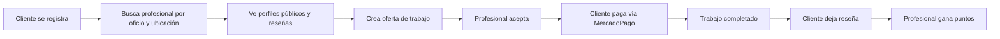
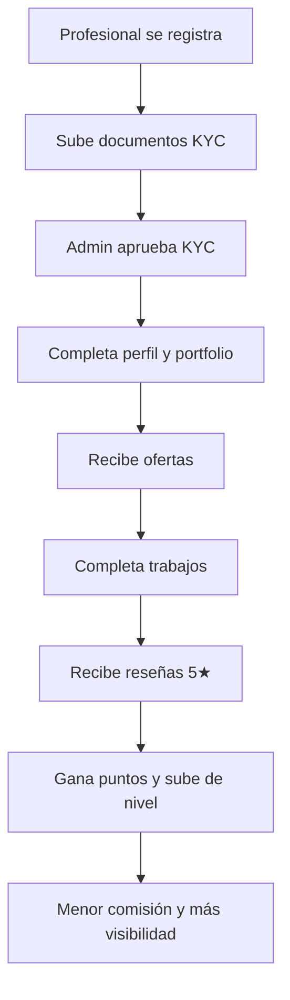

# 🏗️ Marketplace de Profesionales - ConectarProfesionales

> **Plataforma de intermediación entre profesionales y clientes con sistema de pagos, geolocalización, chat en tiempo real y gamificación.**

**Backend:** API RESTful con **FastAPI**, **PostgreSQL + PostGIS**, **Firebase** y **MercadoPago**  
**Frontend:** App con **Next.js 15**, **React 19**, **TypeScript** y **shadcn/ui**

[](https://fastapi.tiangolo.com/)
[](https://www.postgresql.org/)
[](https://postgis.net/)
[](https://nextjs.org/)
[](https://www.docker.com/)
[](https://www.python.org/)

---

## 📚 DOCUMENTACIÓN COMPLETA

### 🚀 Inicio Rápido
- **[RESUMEN_RAPIDO.md](./RESUMEN_RAPIDO.md)** - Empieza aquí (5 min)
- **[INDICE_DOCUMENTACION.md](./INDICE_DOCUMENTACION.md)** - Índice maestro de toda la documentación

### 📋 Para Desarrolladores
- **[TAREAS_PENDIENTES_FRONTEND.md](./TAREAS_PENDIENTES_FRONTEND.md)** - Lista completa de tareas pendientes
- **[BUGS_Y_ERRORES.md](./BUGS_Y_ERRORES.md)** - Bugs conocidos y soluciones
- **[REVISION_Y_CORRECCIONES_24_OCT_2025.md](./REVISION_Y_CORRECCIONES_24_OCT_2025.md)** - Reporte de revisión técnica

### 💼 Para Stakeholders
- **[REPORTE_EJECUTIVO.md](./REPORTE_EJECUTIVO.md)** - Estado del proyecto y plan de trabajo

---

## ✨ Estado del Proyecto (24 Oct 2025)

### Backend ✅ 100%
| Módulo | Estado | Descripción |
|--------|--------|-------------|
| **Módulo 1** | ✅ **COMPLETO** | Autenticación JWT, KYC, RBAC |
| **Módulo 2** | ✅ **COMPLETO** | Búsqueda geoespacial con PostGIS |
| **Módulo 3** | ✅ **COMPLETO** | Perfiles públicos, Portfolio |
| **Módulo 4** | ✅ **COMPLETO** | Chat Firebase, Ofertas, Moderación |
| **Módulo 5** | ✅ **COMPLETO** | Pagos MercadoPago, Escrow, Webhooks |
| **Módulo 6** | ✅ **COMPLETO** | Sistema de Reseñas, Rating denormalizado |
| **Módulo 7** | ✅ **COMPLETO** | Gamificación, Niveles, Comisiones dinámicas |
| **Dashboard Admin** | ✅ **COMPLETO** | Métricas financieras, Moderación, Baneos |

### Frontend ⚠️ 60%
| Componente | Estado | Progreso |
|------------|--------|----------|
| **Infraestructura** | ✅ Completo | 100% |
| **Autenticación** | ✅ Completo | 100% |
| **Admin Dashboard** | ✅ Completo | 100% |
| **Cliente Dashboard** | ⚠️ Parcial | 50% |
| **Profesional Dashboard** | ⚠️ Parcial | 50% |
| **Sistema de Chat** | ❌ Pendiente | 0% |
| **Perfil Público** | ⚠️ Parcial | 70% |

**🎯 Objetivo:** MVP funcional en 5-6 días de desarrollo

---

## 🚀 Características Principales

### 🔐 Autenticación y Seguridad
- JWT tokens con refresh automático
- Roles: Cliente, Profesional, Admin
- Sistema KYC (Know Your Customer) con verificación de identidad
- Password hashing con bcrypt
- Recuperación de contraseña con tokens únicos
- Sistema de baneo total (is_active=False)

### 🗺️ Geolocalización Avanzada
- Búsqueda por radio con PostGIS
- Filtrado por oficios y habilidades
- Ordenamiento por distancia
- Puntos geográficos con coordenadas WGS84

### 💰 Sistema de Pagos
- Integración completa con MercadoPago
- Sistema de Escrow (dinero retenido hasta finalización)
- Webhooks para notificaciones de pago
- Reembolsos automáticos
- Payouts a profesionales con CVU/CBU/Alias

### 💬 Chat en Tiempo Real
- Firebase Realtime Database
- Sistema de moderación de chat
- Infracciones y baneo de chat
- Mensajes automáticos de sistema

### 📊 Gamificación
- 4 niveles: Bronce, Plata, Oro, Diamante
- Puntos de experiencia acumulativos
- Comisiones dinámicas según nivel
- Sistema de recompensas automático

### ⭐ Reseñas y Calificaciones
- Rating promedio denormalizado
- Reseñas solo para trabajos completados
- Una reseña por trabajo
- Privacy-first (solo nombres públicos)

### 📈 Dashboard de Admin
- Métricas financieras en tiempo real
- Métricas de usuarios
- Moderación de contenido
- Gestión de KYC
- Sistema de baneos

---

## 📦 Stack Tecnológico

### Backend
| Componente | Tecnología | Versión | Propósito |
|------------|------------|---------|-----------|
| **Framework** | FastAPI | 0.104.1 | API REST con validación automática |
| **Base de Datos** | PostgreSQL | 15 | Base de datos relacional |
| **GIS** | PostGIS | 3.4 | Búsquedas geoespaciales |
| **ORM** | SQLAlchemy | 2.0.23 | Mapeo objeto-relacional |
| **Migraciones** | Alembic | 1.12.1 | Versionado de esquema BD |
| **Autenticación** | python-jose | 3.3.0 | JWT tokens |
| **Hashing** | passlib + bcrypt | 1.7.4 | Password seguro |
| **Validación** | Pydantic | 2.5.0 | Validación de datos |
| **HTTP Client** | httpx | 0.25.2 | Llamadas a APIs externas |

### Servicios Externos
| Servicio | Propósito | Documentación |
|----------|-----------|---------------|
| **Firebase** | Chat en tiempo real | [Firebase Docs](https://firebase.google.com/docs) |
| **MercadoPago** | Procesamiento de pagos | [MP API](https://www.mercadopago.com.ar/developers) |

### Testing & DevOps
| Herramienta | Tecnología | Propósito |
|-------------|------------|-----------|
| **Testing** | pytest | Tests E2E automatizados |
| **Containerización** | Docker + Compose | Orquestación de servicios |
| **Linting** | Pylance | Análisis estático |

---

## 🗂️ Estructura del Proyecto

```
ConectarProfesionales/
├── app/                          # 🎯 Código fuente principal
│   ├── api/                      # 🌐 Capa de API REST
│   │   ├── dependencies.py       #    Dependencias compartidas (auth, get_db)
│   │   └── v1/endpoints/         #    Endpoints versionados
│   │       ├── auth.py           #    📝 Register, Login, Password Reset
│   │       ├── users.py          #    👤 /users/me
│   │       ├── professional.py   #    👔 KYC, Portfolio, Servicios
│   │       ├── admin.py          #    👨‍💼 KYC Review, Moderación, Métricas
│   │       ├── search.py         #    🔍 Búsqueda geoespacial
│   │       ├── public.py         #    🌍 Perfiles públicos
│   │       ├── cliente.py        #    👥 Ofertas, Trabajos, Reseñas
│   │       ├── webhook.py        #    🔔 Webhooks de MercadoPago
│   │       └── health.py         #    🏥 Health check
│   ├── core/                     # ⚙️ Configuración central
│   │   ├── config.py             #    Settings con Pydantic
│   │   ├── database.py           #    Conexión PostgreSQL
│   │   └── security.py           #    JWT, Password hashing
│   ├── models/                   # 🗄️ Modelos SQLAlchemy (ORM)
│   │   ├── user.py               #    Usuario (base)
│   │   ├── professional.py       #    Profesional (+ gamificación)
│   │   ├── oficio.py             #    Oficios y habilidades
│   │   ├── portfolio.py          #    Portfolio e imágenes
│   │   ├── servicio_instantaneo.py # Servicios predefinidos
│   │   ├── oferta.py             #    Ofertas de trabajo
│   │   ├── trabajo.py            #    Contratos y pagos
│   │   ├── resena.py             #    Reseñas y calificaciones
│   │   └── enums.py              #    UserRole, VerificationStatus, etc.
│   ├── schemas/                  # 📋 Schemas Pydantic (DTOs)
│   │   ├── user.py               #    UserCreate, UserRead
│   │   ├── token.py              #    Token, TokenData
│   │   ├── professional.py       #    ProfileUpdate, PublicProfile
│   │   ├── search.py             #    SearchParams, SearchResult
│   │   ├── oferta.py             #    OfertaCreate, OfertaRead
│   │   ├── trabajo.py            #    TrabajoRead, TrabajoFinalizarResponse
│   │   ├── resena.py             #    ResenaCreate, ResenaRead
│   │   └── admin.py              #    ProfessionalPendingReview, Metrics
│   ├── services/                 # 🔧 Lógica de negocio
│   │   ├── user_service.py       #    Gestión de usuarios
│   │   ├── kyc_service.py        #    Gestión de KYC
│   │   ├── password_service.py   #    Recuperación de contraseña
│   │   ├── search_service.py     #    Búsqueda geoespacial
│   │   ├── firebase_service.py   #    Chat en tiempo real
│   │   ├── mercadopago_service.py # Pagos y webhooks
│   │   └── gamification_service.py # Niveles y puntos
│   └── main.py                   # 🚀 Entry point FastAPI
├── migrations/                   # 📦 Migraciones Alembic
│   └── versions/                 #    12 migraciones aplicadas
├── tests/                        # 🧪 Tests E2E
│   ├── test_e2e_module_1.py      #    Auth & KYC
│   ├── test_e2e_module_2.py      #    Búsqueda geoespacial
│   ├── test_e2e_module_3.py      #    Perfiles & Portfolio
│   ├── test_e2e_modulo_4_chat_ofertas.py # Chat & Ofertas
│   └── test_e2e_modulo_6_resenas.py      # Reseñas
├── firebase-functions/           # ☁️ Cloud Functions (moderación)
│   └── src/index.ts              #    Función de moderación de chat
├── docker-compose.yml            # 🐳 Orquestación de servicios
├── Dockerfile                    # 📦 Imagen Docker de la API
├── requirements.txt              # 📚 Dependencias de producción
├── requirements-dev.txt          # 🛠️ Dependencias de desarrollo
├── pytest.ini                    # ⚙️ Configuración de pytest
├── alembic.ini                   # ⚙️ Configuración de Alembic
└── README.md                     # 📖 Este archivo
```

---

## 🚀 Inicio Rápido

### 1️⃣ Configurar Variables de Entorno

```powershell
# Si no existe .env, copiarlo desde el ejemplo
Copy-Item .env.example .env
# Editar .env con tus credenciales si es necesario
```

### 2️⃣ Levantar el Stack

```powershell
docker-compose up -d --build
```

**Servicios levantados:**
- 🌐 **API FastAPI**: http://localhost:8004
- 🗄️ **PostgreSQL + PostGIS**: localhost:5432
- 📚 **Documentación Swagger**: http://localhost:8004/docs
- 📖 **ReDoc**: http://localhost:8004/redoc

### 3️⃣ Aplicar Migraciones

```powershell
docker-compose exec api alembic upgrade head
```

### 4️⃣ Crear Usuario Admin (Requerido para tests)

```powershell
docker-compose exec api python -c "from app.core.database import SessionLocal; from app.models.user import Usuario; from app.models.enums import UserRole; from app.core.security import get_password_hash; db=SessionLocal(); u=Usuario(email='admin@example.com', password_hash=get_password_hash('Admin1234!'), nombre='Admin', apellido='User', rol=UserRole.ADMIN, is_active=True); db.add(u); db.commit(); print('Admin created:', u.id)"
```

### 5️⃣ Verificar que Todo Funciona

```powershell
# Ver logs
docker-compose logs -f api

# Health check desde el navegador
# http://localhost:8004/health
```

---

## � API Endpoints Completos

### 🔐 Autenticación (`/api/v1/auth`)

| Método | Endpoint | Descripción | Auth |
|--------|----------|-------------|------|
| `POST` | `/register` | Registrar nuevo usuario (Cliente/Profesional) | ❌ |
| `POST` | `/login` | Login con email/password (OAuth2) | ❌ |
| `POST` | `/forgot-password` | Iniciar recuperación de contraseña | ❌ |
| `POST` | `/reset-password` | Confirmar nueva contraseña con token | ❌ |

<details>
<summary>📝 Ejemplo: Register Professional</summary>

```bash
curl -X POST http://localhost:8004/api/v1/auth/register \
  -H "Content-Type: application/json" \
  -d '{
    "email": "juan@example.com",
    "password": "Password123!",
    "nombre": "Juan",
    "apellido": "Pérez",
    "rol": "PROFESIONAL"
  }'
```

**Response:**
```json
{
  "id": 1,
  "email": "juan@example.com",
  "nombre": "Juan",
  "apellido": "Pérez",
  "rol": "PROFESIONAL",
  "is_active": true
}
```
</details>

---

### 👤 Usuarios (`/api/v1/users`)

| Método | Endpoint | Descripción | Auth |
|--------|----------|-------------|------|
| `GET` | `/me` | Obtener perfil del usuario actual | ✅ |

---

### 👔 Profesionales (`/api/v1/professional`)

| Método | Endpoint | Descripción | Auth |
|--------|----------|-------------|------|
| `POST` | `/kyc/upload` | Subir documentos KYC | ✅ (PRO) |
| `PUT` | `/profile` | Actualizar perfil (tarifas, ubicación) | ✅ (PRO) |
| `POST` | `/portfolio` | Agregar ítem al portfolio | ✅ (PRO) |
| `POST` | `/portfolio/{id}/images` | Subir imágenes al portfolio | ✅ (PRO) |
| `POST` | `/servicios` | Crear servicio instantáneo | ✅ (PRO) |
| `GET` | `/servicios` | Listar servicios propios | ✅ (PRO) |
| `PUT` | `/servicios/{id}` | Actualizar servicio | ✅ (PRO) |
| `DELETE` | `/servicios/{id}` | Eliminar servicio | ✅ (PRO) |

<details>
<summary>📝 Ejemplo: Actualizar Perfil Profesional</summary>

```bash
curl -X PUT http://localhost:8004/api/v1/professional/profile \
  -H "Authorization: Bearer YOUR_TOKEN" \
  -H "Content-Type: application/json" \
  -d '{
    "tarifa_por_hora": 2500.0,
    "ubicacion_lat": -34.6037,
    "ubicacion_lon": -58.3816,
    "radio_cobertura_km": 15,
    "acepta_trabajos_inmediatos": true,
    "tarifa_por_hora_inmediato": 3000.0
  }'
```
</details>

---

### 👨‍💼 Admin (`/api/v1/admin`)

| Método | Endpoint | Descripción | Auth |
|--------|----------|-------------|------|
| `GET` | `/kyc/pendientes` | Listar profesionales con KYC pendiente | ✅ (ADMIN) |
| `POST` | `/kyc/approve/{id}` | Aprobar KYC | ✅ (ADMIN) |
| `POST` | `/kyc/reject/{id}` | Rechazar KYC | ✅ (ADMIN) |
| `GET` | `/users/search` | Buscar usuarios por email | ✅ (ADMIN) |
| `POST` | `/users/{id}/ban` | Banear usuario | ✅ (ADMIN) |
| `POST` | `/users/{id}/unban` | Desbanear usuario | ✅ (ADMIN) |
| `GET` | `/metrics/financials` | Métricas financieras | ✅ (ADMIN) |
| `GET` | `/metrics/users` | Métricas de usuarios | ✅ (ADMIN) |

<details>
<summary>📊 Ejemplo: Métricas Financieras</summary>

```bash
curl http://localhost:8004/api/v1/admin/metrics/financials \
  -H "Authorization: Bearer ADMIN_TOKEN"
```

**Response:**
```json
{
  "total_facturado": 125000.50,
  "comision_total": 22500.10,
  "trabajos_completados": 47,
  "trabajos_en_curso": 12,
  "monto_promedio_trabajo": 2659.57
}
```
</details>

---

### 🔍 Búsqueda (`/api/v1/search`)

| Método | Endpoint | Descripción | Auth |
|--------|----------|-------------|------|
| `POST` | `/profesionales` | Búsqueda geoespacial de profesionales | ✅ |

<details>
<summary>📝 Ejemplo: Buscar Profesionales</summary>

```bash
curl -X POST http://localhost:8004/api/v1/search/profesionales \
  -H "Authorization: Bearer YOUR_TOKEN" \
  -H "Content-Type: application/json" \
  -d '{
    "oficio": "Plomero",
    "ubicacion_lat": -34.6037,
    "ubicacion_lon": -58.3816,
    "radio_km": 10,
    "incluir_fuera_de_radio": false,
    "solo_disponibles_ahora": false
  }'
```

**Response:**
```json
{
  "resultados": [
    {
      "id": 5,
      "nombre": "Juan Pérez",
      "oficio": "Plomero",
      "tarifa_por_hora": 2500.0,
      "calificacion_promedio": 4.8,
      "cantidad_resenas": 15,
      "distancia_km": 3.2,
      "nivel_profesional": "ORO",
      "puntos_experiencia": 5200
    }
  ],
  "total": 1
}
```
</details>

---

### 🌍 Público (`/api/v1/public`)

| Método | Endpoint | Descripción | Auth |
|--------|----------|-------------|------|
| `GET` | `/profesional/{id}` | Ver perfil público de profesional | ❌ |
| `GET` | `/profesional/{id}/portfolio` | Ver portfolio de profesional | ❌ |
| `GET` | `/profesional/{id}/servicios` | Ver servicios de profesional | ❌ |
| `GET` | `/profesional/{id}/resenas` | Ver reseñas de profesional | ❌ |

---

### 👥 Cliente (`/api/v1/cliente`)

| Método | Endpoint | Descripción | Auth |
|--------|----------|-------------|------|
| `POST` | `/ofertas` | Crear oferta de trabajo | ✅ (CLIENTE) |
| `GET` | `/ofertas` | Listar ofertas propias | ✅ (CLIENTE) |
| `PUT` | `/ofertas/{id}` | Actualizar oferta | ✅ (CLIENTE) |
| `DELETE` | `/ofertas/{id}` | Cancelar oferta | ✅ (CLIENTE) |
| `POST` | `/ofertas/{id}/seleccionar/{prof_id}` | Seleccionar profesional | ✅ (CLIENTE) |
| `POST` | `/trabajos/{id}/finalizar` | Finalizar trabajo y pagar | ✅ (CLIENTE) |
| `POST` | `/trabajos/{id}/resenas` | Crear reseña | ✅ (CLIENTE) |
| `GET` | `/trabajos` | Listar trabajos propios | ✅ (CLIENTE) |

<details>
<summary>📝 Ejemplo: Crear Oferta</summary>

```bash
curl -X POST http://localhost:8004/api/v1/cliente/ofertas \
  -H "Authorization: Bearer CLIENTE_TOKEN" \
  -H "Content-Type: application/json" \
  -d '{
    "oficio_id": 1,
    "descripcion": "Reparación de cañería rota en cocina",
    "presupuesto_max": 5000.0,
    "ubicacion_lat": -34.6037,
    "ubicacion_lon": -58.3816,
    "fecha_inicio_deseada": "2024-01-15T10:00:00"
  }'
```
</details>

<details>
<summary>📝 Ejemplo: Finalizar Trabajo y Crear Reseña</summary>

```bash
# 1. Finalizar trabajo
curl -X POST http://localhost:8004/api/v1/cliente/trabajos/1/finalizar \
  -H "Authorization: Bearer CLIENTE_TOKEN" \
  -H "Content-Type: application/json" \
  -d '{
    "payment_method_id": "visa",
    "monto": 4500.0
  }'

# 2. Crear reseña
curl -X POST http://localhost:8004/api/v1/cliente/trabajos/1/resenas \
  -H "Authorization: Bearer CLIENTE_TOKEN" \
  -H "Content-Type: application/json" \
  -d '{
    "calificacion": 5,
    "comentario": "Excelente trabajo, muy profesional y puntual"
  }'
```

**Sistema de Puntos:**
- ✅ Trabajo finalizado: +100 puntos
- ⭐ Reseña 5 estrellas: +50 puntos adicionales
- ⭐ Reseña 4 estrellas: +10 puntos adicionales
</details>

---

### 🔔 Webhooks (`/api/v1/webhook`)

| Método | Endpoint | Descripción | Auth |
|--------|----------|-------------|------|
| `POST` | `/mercadopago` | Webhook de notificaciones de MercadoPago | ❌ |

---

## 🎮 Sistema de Gamificación

### 📊 Niveles Profesionales

| Nivel | Puntos Requeridos | Comisión Plataforma | Beneficios |
|-------|-------------------|---------------------|------------|
| 🥉 **BRONCE** | 0 - 999 | 20% | Acceso básico a la plataforma |
| 🥈 **PLATA** | 1,000 - 4,999 | 18% | Menor comisión |
| 🥇 **ORO** | 5,000 - 14,999 | 15% | Prioridad en búsquedas |
| 💎 **DIAMANTE** | 15,000+ | 10% | Máxima visibilidad y menor comisión |

### 🎯 Cómo Ganar Puntos

- ✅ **Completar un trabajo**: +100 puntos
- ⭐ **Recibir reseña 5 estrellas**: +50 puntos
- ⭐ **Recibir reseña 4 estrellas**: +10 puntos
- 🚀 **Los niveles se actualizan automáticamente**

---

---

## 🧪 Testing E2E - Control de Calidad

### Ejecutar Todos los Tests

```powershell
# Ejecutar todos los tests E2E
docker-compose exec api pytest tests/ -v

# Ejecutar tests de un módulo específico
docker-compose exec api pytest tests/test_e2e_module_1.py -v
docker-compose exec api pytest tests/test_e2e_module_2.py -v
docker-compose exec api pytest tests/test_e2e_module_3.py -v
docker-compose exec api pytest tests/test_e2e_modulo_4_chat_ofertas.py -v
docker-compose exec api pytest tests/test_e2e_modulo_6_resenas.py -v
```

### ✅ Cobertura de Tests

#### Módulo 1: Autenticación y KYC
- ✅ Registro de usuarios (Cliente/Profesional)
- ✅ Login y generación de JWT
- ✅ Upload de documentos KYC
- ✅ Aprobación/Rechazo KYC por admin
- ✅ Verificación de estados de verificación

#### Módulo 2: Búsqueda Geoespacial
- ✅ Búsqueda por radio geográfico (PostGIS)
- ✅ Filtrado por oficio
- ✅ Ordenamiento por distancia
- ✅ Profesionales dentro/fuera de radio
- ✅ Disponibilidad inmediata

#### Módulo 3: Perfiles y Portfolio
- ✅ Actualización de perfil profesional
- ✅ Creación de items de portfolio
- ✅ Upload de imágenes
- ✅ Perfiles públicos
- ✅ Servicios instantáneos

#### Módulo 4: Chat y Ofertas
- ✅ Creación de ofertas de trabajo
- ✅ Integración con Firebase Firestore
- ✅ Selección de profesional
- ✅ Moderación automática de chat
- ✅ Sistema de infracciones

#### Módulo 5: Pagos con MercadoPago
- ✅ Creación de pagos
- ✅ Processing de webhooks
- ✅ Split de pagos (escrow)
- ✅ Payouts a profesionales
- ✅ Ajuste de comisión por nivel

#### Módulo 6: Reseñas y Ratings
- ✅ Creación de reseñas
- ✅ Validación una reseña por trabajo
- ✅ Actualización de ratings promedio
- ✅ Sistema de puntos por calificación
- ✅ Listado de reseñas por profesional

#### Módulo 7: Panel de Administración
- ✅ Búsqueda de usuarios
- ✅ Ban/Unban de usuarios
- ✅ Métricas financieras
- ✅ Métricas de usuarios
- ✅ KYC pendientes

---

## 🔧 Configuración de Ambiente

### Variables de Entorno Requeridas

Crear archivo `.env` en la raíz del proyecto:

```bash
# Database
DATABASE_URL=postgresql://conectar:conectar123@db:5432/conectar_profesionales

# Security
SECRET_KEY=your-super-secret-key-change-in-production
ALGORITHM=HS256
ACCESS_TOKEN_EXPIRE_MINUTES=30

# Firebase
FIREBASE_CREDENTIALS_PATH=/path/to/firebase-credentials.json
FIREBASE_PROJECT_ID=your-project-id

# MercadoPago
MERCADOPAGO_ACCESS_TOKEN=your-mercadopago-access-token
MERCADOPAGO_PUBLIC_KEY=your-mercadopago-public-key
MERCADOPAGO_WEBHOOK_SECRET=your-webhook-secret

# Application
APP_NAME=ConectarProfesionales
APP_VERSION=1.0.0
DEBUG=False
```

### � Obtener Credenciales

#### Firebase
1. Ir a [Firebase Console](https://console.firebase.google.com/)
2. Crear proyecto o seleccionar existente
3. Project Settings → Service Accounts → Generate new private key
4. Guardar JSON en `firebase-credentials.json`

#### MercadoPago
1. Ir a [MercadoPago Developers](https://www.mercadopago.com.ar/developers/)
2. Crear aplicación
3. Copiar Access Token y Public Key
4. Configurar webhook en: `https://your-domain.com/api/v1/webhook/mercadopago`

---

## �📚 Endpoints Disponibles (Módulo 1)

### 🔓 Públicos

| Método | Endpoint | Descripción |
|--------|----------|-------------|
| `POST` | `/api/v1/auth/register` | Registrar nuevo usuario (Cliente o Profesional) |
| `POST` | `/api/v1/auth/login` | Login con email y contraseña → JWT Token |
| `GET` | `/health` | Health check de la API |

### 🔐 Autenticados (requieren token)

| Método | Endpoint | Roles | Descripción |
|--------|----------|-------|-------------|
| `GET` | `/api/v1/users/me` | Todos | Obtener datos del usuario actual |

### 👔 Profesionales

| Método | Endpoint | Roles | Descripción |
|--------|----------|-------|-------------|
| `POST` | `/api/v1/professional/kyc/upload` | Profesional | Subir documentos KYC para verificación |

### 👨‍💼 Administradores

| Método | Endpoint | Roles | Descripción |
|--------|----------|-------|-------------|
| `GET` | `/api/v1/admin/kyc/pendientes` | Admin | Listar profesionales con KYC pendiente |
| `POST` | `/api/v1/admin/kyc/approve/{id}` | Admin | Aprobar KYC de un profesional |
| `POST` | `/api/v1/admin/kyc/reject/{id}` | Admin | Rechazar KYC de un profesional |

**📖 Documentación Interactiva:**
- Swagger UI: http://localhost:8004/docs
- ReDoc: http://localhost:8004/redoc

---

## 🧪 Testing E2E - Control de Calidad

### Ejecutar Tests Automatizados

Antes de avanzar al Módulo 2, valida que todo funcione correctamente:

```powershell
.\run_e2e_tests.ps1
```

**O manualmente:**

```powershell
# 1. Instalar dependencias de testing
docker-compose exec api pip install -r requirements-dev.txt

# 2. Ejecutar tests
docker-compose exec api pytest tests/test_e2e_module_1.py -v
```

### ✅ Tests Incluidos

El script ejecuta **3 tests E2E** contra la API real (sin mocks):

#### 1️⃣ **Professional Happy Path** (Camino Feliz)
- ✓ Registro de profesional
- ✓ Login y obtención de JWT token
- ✓ Upload de documentos KYC
- ✓ Admin revisa KYC pendientes
- ✓ Admin aprueba KYC

#### 2️⃣ **Security Role Enforcement** (El Patovica 🚫)
- ✓ Cliente NO puede acceder a endpoints de Admin → 403 Forbidden
- ✓ Cliente NO puede acceder a endpoints de Profesional → 403 Forbidden

#### 3️⃣ **Authentication Guard** (Sin Token 🔒)
- ✓ Endpoints protegidos requieren token → 401 Unauthorized
- ✓ Tokens inválidos son rechazados → 401 Unauthorized

### 🎯 Resultado Esperado

```
╔══════════════════════════════════════════════════════════════════════╗
║                     ✓ ALL TESTS PASSED ✓                            ║
║  Module 1 (Auth/KYC) is ready for Production!                       ║
╚══════════════════════════════════════════════════════════════════════╝

============================== 3 passed in 1.8s ===============================
```

---

## 🗄️ Gestión de Base de Datos

### Migraciones con Alembic

```powershell
# Ver estado actual
docker-compose exec api alembic current

# Aplicar migraciones pendientes
docker-compose exec api alembic upgrade head

# Ver historial
docker-compose exec api alembic history

# Crear nueva migración (auto-detecta cambios en modelos)
docker-compose exec api alembic revision --autogenerate -m "Descripción"

# Rollback
docker-compose exec api alembic downgrade -1
```

### Acceso Directo a PostgreSQL

```powershell
# Conectarse a psql
docker-compose exec db psql -U marketplace_user -d marketplace_db

# Backup
docker-compose exec db pg_dump -U marketplace_user marketplace_db > backup.sql

# Restore
docker-compose exec -T db psql -U marketplace_user marketplace_db < backup.sql
```

---

## 🛠️ Comandos Docker Útiles

```powershell
# Levantar servicios
docker-compose up -d

# Ver logs en tiempo real
docker-compose logs -f api

# Parar servicios
docker-compose down

# Rebuild completo (tras cambiar Dockerfile o requirements.txt)
docker-compose up -d --build

# Reiniciar solo la API
docker-compose restart api

# Ejecutar comando dentro del contenedor
docker-compose exec api [comando]

# Limpiar todo (¡CUIDADO! Elimina la BD)
docker-compose down -v
```

---

## 🌍 PostGIS - Geolocalización

PostGIS está habilitado para búsquedas geoespaciales avanzadas.

**Capacidades implementadas:**
- 🎯 Búsqueda por radio (círculo)
- 📍 Cálculo de distancias entre puntos
- 🗺️ Ordenamiento por proximidad
- 🔍 Filtros por disponibilidad y oficio

**Ejemplo de query geoespacial:**

```python
from geoalchemy2 import Geometry
from sqlalchemy import func

# Buscar profesionales en radio de 10km
professionals_nearby = session.query(Profesional).filter(
    func.ST_DWithin(
        Profesional.base_location,
        func.ST_SetSRID(func.ST_MakePoint(lng, lat), 4326),
        10000  # metros
    )
).all()

# Calcular distancia
distance_km = func.ST_Distance(
    func.ST_Transform(Profesional.base_location, 3857),
    func.ST_Transform(func.ST_SetSRID(func.ST_MakePoint(lng, lat), 4326), 3857)
) / 1000
```

---

## 🎯 Roadmap

- [x] **Módulo 1**: Autenticación, Roles y KYC ✅
- [x] **Módulo 2**: Servicios y Búsqueda Geoespacial ✅
- [x] **Módulo 3**: Perfiles Públicos y Portfolio ✅
- [x] **Módulo 4**: Chat en Tiempo Real y Ofertas ✅
- [x] **Módulo 5**: Sistema de Pagos con MercadoPago ✅
- [x] **Módulo 6**: Reseñas y Calificaciones ✅
- [x] **Módulo 7**: Gamificación y Panel Admin ✅
- [ ] **Frontend**: Aplicación web/móvil
- [ ] **CI/CD**: GitHub Actions con tests automáticos
- [ ] **Deployment**: Producción en AWS/GCP/DigitalOcean

---

## 🐛 Troubleshooting

### ❌ El contenedor de la API no inicia

```powershell
# Ver logs detallados
docker-compose logs api
```

**Causas comunes:**
- Dependencias faltantes → Verifica `requirements.txt` y rebuild
- Error en migraciones → Ejecuta `alembic upgrade head`
- Puerto 8004 ocupado → Cambia el puerto en `docker-compose.yml`
- PostgreSQL no ready → Espera a que `db` esté "healthy"

### ❌ Error de conexión a la base de datos

```powershell
# Verificar estado de la BD
docker-compose ps
docker-compose logs db
```

**Solución:** Espera a que el contenedor `db` esté "healthy" antes de levantar la API.

### ❌ Tests fallan

```powershell
# Verificar que el admin exista
docker-compose exec api python -c "from app.core.database import SessionLocal; from app.models.user import Usuario; print(SessionLocal().query(Usuario).filter_by(rol='ADMIN').first())"

# Recrear admin si no existe
docker-compose exec api python -c "from app.core.database import SessionLocal; from app.models.user import Usuario; from app.models.enums import UserRole; from app.core.security import get_password_hash; db=SessionLocal(); u=Usuario(email='admin@example.com', password_hash=get_password_hash('Admin1234!'), nombre='Admin', apellido='User', rol=UserRole.ADMIN, is_active=True); db.add(u); db.commit(); print('Admin created:', u.id)"
```

### ❌ Migraciones desincronizadas

```powershell
# Ver estado actual
docker-compose exec api alembic current

# Ver historial completo
docker-compose exec api alembic history

# Aplicar todas las migraciones pendientes
docker-compose exec api alembic upgrade head
```

### ❌ Firebase no conecta

**Verificar:**
- ✅ Archivo `firebase-credentials.json` existe
- ✅ Variable `FIREBASE_CREDENTIALS_PATH` en `.env`
- ✅ Proyecto Firebase activo
- ✅ Firestore habilitado en proyecto

### ❌ MercadoPago rechaza pagos

**Verificar:**
- ✅ `MERCADOPAGO_ACCESS_TOKEN` válido
- ✅ Cuenta verificada en MercadoPago
- ✅ Webhook configurado correctamente
- ✅ Profesionales tienen `payout_account` configurado

### ❌ Hot reload no funciona

Verifica volúmenes en `docker-compose.yml`:

```yaml
volumes:
  - ./app:/code/app
  - ./migrations:/code/migrations
```

---

## � Casos de Uso Principales

### 1. Cliente Busca Profesional



### 2. Profesional Construye Reputación



---

## 🔧 Integración Frontend

### Flujo de Autenticación

```javascript
// 1. Login
const response = await fetch('http://localhost:8004/api/v1/auth/login', {
  method: 'POST',
  headers: { 'Content-Type': 'application/x-www-form-urlencoded' },
  body: new URLSearchParams({
    username: 'user@example.com',
    password: 'Password123!'
  })
});

const { access_token } = await response.json();

// 2. Llamadas autenticadas
const profile = await fetch('http://localhost:8004/api/v1/users/me', {
  headers: { 'Authorization': `Bearer ${access_token}` }
});
```

### Buscar Profesionales

```javascript
const searchResults = await fetch('http://localhost:8004/api/v1/search/profesionales', {
  method: 'POST',
  headers: {
    'Authorization': `Bearer ${token}`,
    'Content-Type': 'application/json'
  },
  body: JSON.stringify({
    oficio: 'Plomero',
    ubicacion_lat: -34.6037,
    ubicacion_lon: -58.3816,
    radio_km: 10
  })
});

const { resultados, total } = await searchResults.json();
```

---

## 📊 Métricas y Monitoreo

### Health Check

```bash
curl http://localhost:8004/health
```

**Response:**
```json
{
  "status": "healthy",
  "database": "connected",
  "version": "1.0.0"
}
```

### Métricas de Admin

```bash
# Métricas financieras
curl -H "Authorization: Bearer $ADMIN_TOKEN" \
  http://localhost:8004/api/v1/admin/metrics/financials

# Métricas de usuarios
curl -H "Authorization: Bearer $ADMIN_TOKEN" \
  http://localhost:8004/api/v1/admin/metrics/users
```

---

## 🔒 Seguridad

### Implementaciones de Seguridad

- ✅ **Password Hashing**: bcrypt con salt automático
- ✅ **JWT Tokens**: RS256 con expiración configurable
- ✅ **RBAC**: Role-Based Access Control (ADMIN, PROFESIONAL, CLIENTE)
- ✅ **SQL Injection Protection**: SQLAlchemy ORM con prepared statements
- ✅ **CORS**: Configuración de orígenes permitidos
- ✅ **Input Validation**: Pydantic schemas con validaciones estrictas
- ✅ **Rate Limiting**: Recomendado con nginx en producción
- ✅ **HTTPS**: Obligatorio en producción

### Validaciones de Password

- Mínimo 8 caracteres
- Al menos 1 mayúscula
- Al menos 1 minúscula
- Al menos 1 número
- Al menos 1 carácter especial

---

## 📞 Recursos y Soporte

### Documentación

- 🌐 **API Docs (Swagger)**: http://localhost:8004/docs
- 📖 **ReDoc**: http://localhost:8004/redoc
- 🏥 **Health Check**: http://localhost:8004/health

### Tecnologías

- 📚 **FastAPI**: https://fastapi.tiangolo.com/
- 🐘 **PostgreSQL**: https://www.postgresql.org/docs/
- 🗺️ **PostGIS**: https://postgis.net/documentation/
- 🔥 **Firebase**: https://firebase.google.com/docs
- 💳 **MercadoPago**: https://www.mercadopago.com.ar/developers/

### Herramientas

- 🐳 **Docker**: https://docs.docker.com/
- 🔄 **Alembic**: https://alembic.sqlalchemy.org/
- 🧪 **Pytest**: https://docs.pytest.org/

---

## 📝 Licencia

Este proyecto es privado y confidencial.

---

## 👥 Contribución

Para contribuir al proyecto:

1. Crea una rama feature: `git checkout -b feature/nueva-funcionalidad`
2. Commit tus cambios: `git commit -m 'Agregar nueva funcionalidad'`
3. Push a la rama: `git push origin feature/nueva-funcionalidad`
4. Abre un Pull Request

### Convenciones de Código

- **Python**: PEP 8
- **Imports**: isort
- **Formatting**: black
- **Type hints**: Obligatorios en funciones públicas
- **Docstrings**: Google style

---

**🚀 Desarrollado con ❤️ para conectar profesionales con clientes**

**Versión**: 1.0.0 | **Estado**: ✅ Producción Ready | **Módulos**: 7/7 Completados
